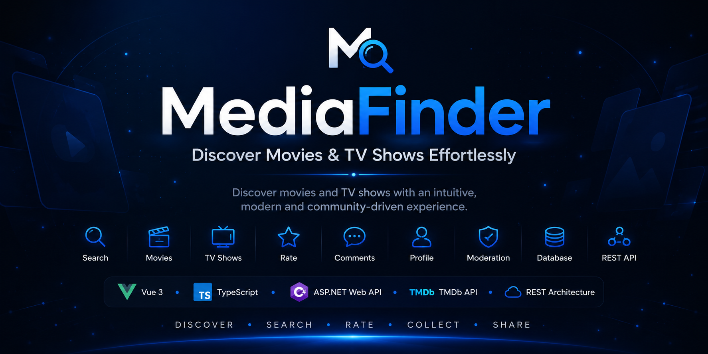

<p align="center">
    
</p>

<h1 align="center">MediaFinder API</h1>

<p align="center">
  ASP.NET Web API powering the MediaFinder application.
  <br>
  Built to handle media discovery, authentication, favorites, comments, ratings,
  moderation, administration and external API integrations.
</p>

<p align="center">


</p>
# 🚀 API Overview

MediaFinder API is the backend service behind the MediaFinder frontend.

It exposes REST endpoints for movies, TV shows, search, user accounts, favorites, ratings, comments, moderation and administration features.

The API integrates with external providers such as TMDb and eBay Browse API while keeping business logic separated into dedicated services.

# ✨ What MediaFinder API Provides

## 🎬 Media Data

- Movie discovery
- TV show discovery
- Media details
- Genres
- Cast and crew data
- Trending content
- Watch providers

## 🔍 Search

- Movie search
- TV show search
- People search
- Genre-based search
- Multi-source media lookup

## 👤 User Features

- Authentication
- User profile data
- Favorites
- Ratings
- Comments

## 💬 Community

- Comment creation
- Comment deletion
- User comment history
- Report inappropriate comments
- Community ratings

## 🛡 Moderation & Administration

- User management
- Role management
- Moderator and Administrator roles
- Warning system
- Automatic ban after three warnings
- Ban / unban users
- Reset warnings
- Comment reports management

## 🌍 Localization

- Language resolution
- Country resolution
- Localized TMDb requests
- Region-based watch providers

# 🏛 Backend Architecture

MediaFinder API follows a clean layered architecture designed to promote maintainability, scalability and separation of concerns.

Each layer has a single responsibility, allowing the application to remain modular, easy to extend and simple to maintain as new features are introduced.

```text
Controllers
      │
      ▼
Application Services
      │
      ▼
External Providers / Data Access
      │
      ▼
DTOs & Response Models
```

## Design Principles

The backend has been designed around modern ASP.NET development practices:

- Thin controllers focused on request handling
- Business logic isolated within dedicated service classes
- Dependency Injection throughout the application
- Interface-driven architecture for improved testability
- DTOs used to decouple API contracts from internal models
- External API integrations encapsulated in dedicated providers
- Configuration managed through the Options Pattern
- Consistent RESTful endpoint design

# 🔒 Authentication & Authorization

MediaFinder API implements a role-based authorization system to secure protected resources and administrative features.

## Authentication

- Secure user authentication
- Protected API endpoints
- User account management

## Authorization

Role-based permissions are used to control access across the application.

### User

- Manage favorites
- Create ratings
- Post comments
- Report inappropriate comments

### Moderator

- Review reported comments
- Issue warnings
- Moderate community content

### Administrator

- Manage users
- Assign roles
- Ban and unban accounts
- Reset warnings
- Access administration endpoints

## Community Moderation

MediaFinder includes an integrated moderation workflow designed to maintain a healthy community.

Features include:

- Comment reporting
- Warning management
- Automatic account suspension after three warnings
- Role-based moderation tools

# 🛠 Built With

## Backend Technologies

| Technology | Purpose |
|------------|---------|
| **ASP.NET Web API** | REST API framework |
| **C#** | Primary programming language |
| **Entity Framework Core** | Data persistence |
| **Swagger / OpenAPI** | API documentation |
| **Dependency Injection** | Service management |
| **HttpClient** | External API communication |
| **Options Pattern** | Configuration management |

## External Services

| Service | Purpose |
|----------|---------|
| **TMDb API** | Movies and TV shows metadata |
| **eBay Browse API** | Physical media offers |

# ⚙️ Core API Capabilities

The backend is organized into dedicated modules, each responsible for a specific business domain.

| Module | Description |
|---------|-------------|
| **Authentication** | User authentication and authorization |
| **Movies** | Movie discovery and detailed information |
| **TV Shows** | Series discovery and detailed information |
| **Search** | Movies, TV shows, genres and people search |
| **Favorites** | User favorite media management |
| **Ratings** | Community rating system |
| **Comments** | Comment creation and management |
| **Reports** | Comment reporting workflow |
| **Administration** | User management, roles, warnings and bans |
| **Localization** | Language and region-aware requests |
| **Providers** | External service integrations (TMDb, eBay) |

## 📄 License

This project is released under the MIT License.

## 📌 Project Status

MediaFinder is actively developed and continuously improved as a full-stack portfolio project.

New features and improvements are added regularly.

## 🤝 Contributing

Contributions, suggestions and feedback are always welcome.